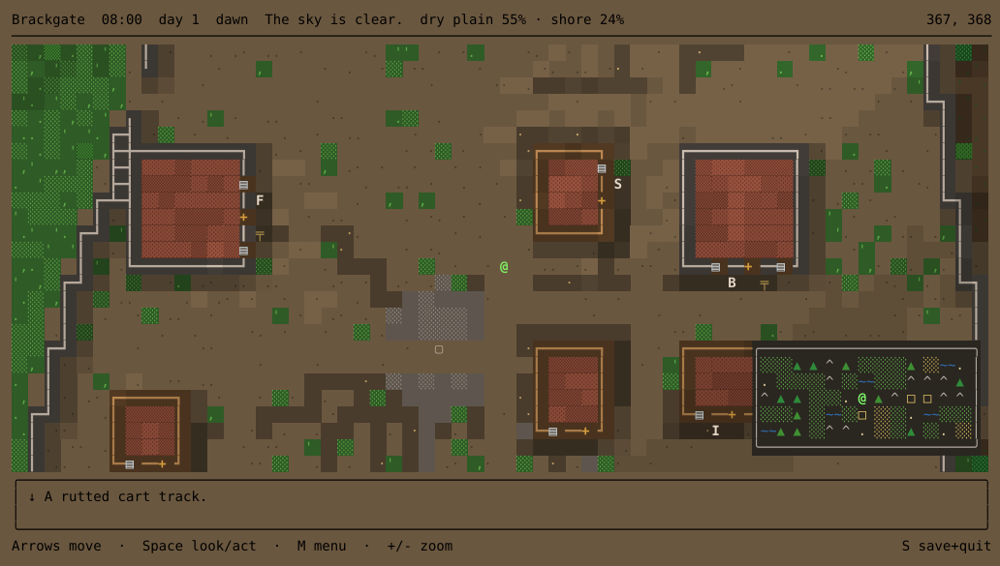
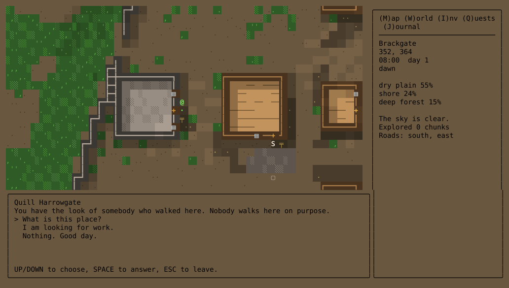
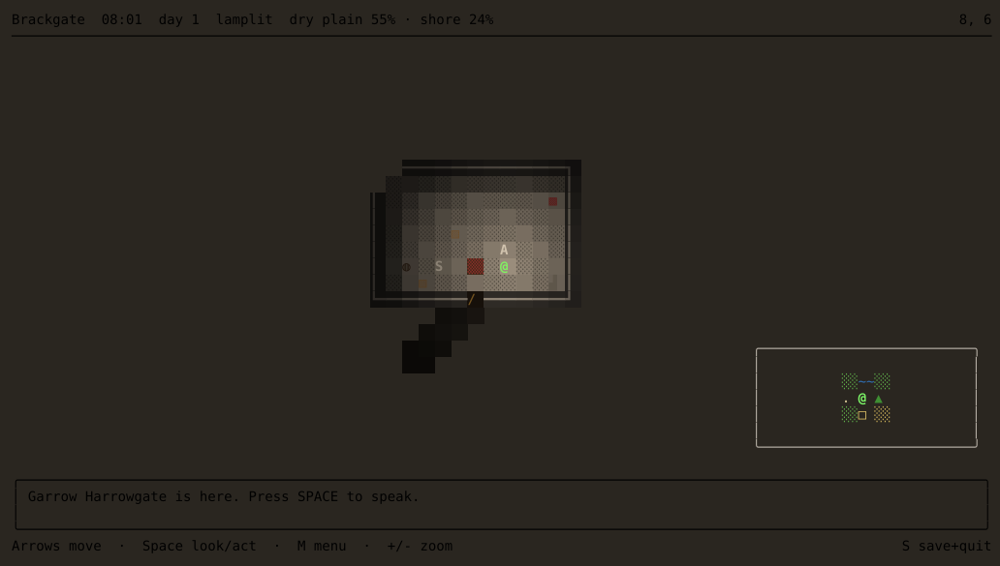
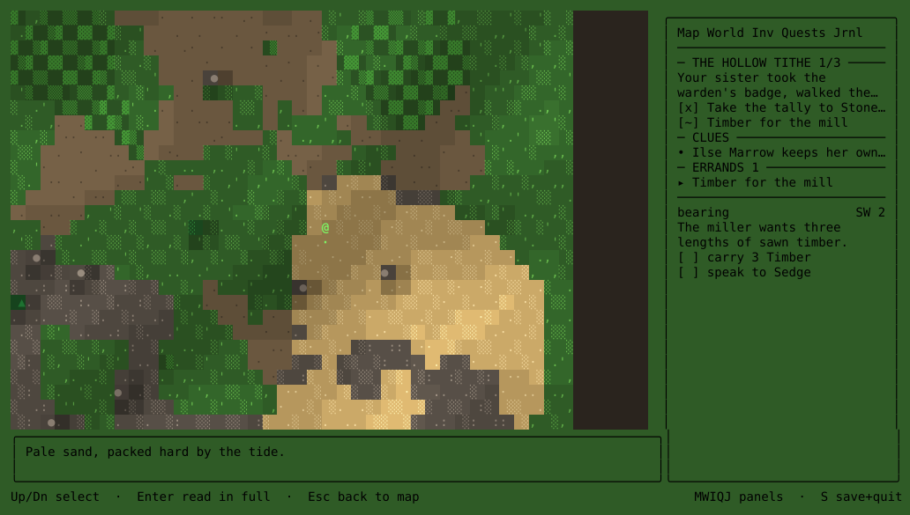
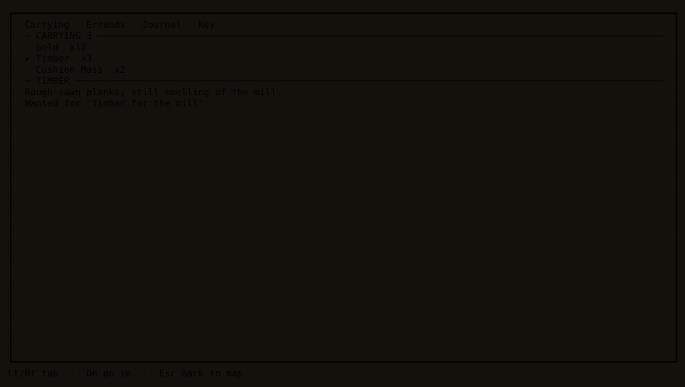

# auto-adventure

A terminal RPG on an infinite, seamless, procedurally generated world, with an
LLM as its author rather than its renderer.


```
npm install
npm start                 # play
NO_AI=1 npm start         # play with no model at all
SCENARIO_PROMPT="a drowned archipelago run by debt-collectors" npm start
npm run preview -- --seed vale --at 0,0    # dump a chunk to stdout
npm run preview -- --at 0,0 --ascii        # ...as one ASCII byte per tile
npm run preview -- --at 0,0 --flat         # ...with shadows and slope shading off
npm run preview -- --at 0,0 --xscale 1     # ...one column per tile instead of two
npm run check             # typecheck + lint + tests
```

## The idea

The engine decides **what exists**; the model decides **what it is called and
who lives there**. No model call ever emits a tile, and no model call is ever on
the movement path.

Every tile is a pure function of `(worldSeed, globalPosition)` plus feature data
that is itself a pure function of `(worldSeed, macroCoordinate)`. There is no
boundary in the function, so there is no boundary in the output — seams are
impossible rather than repaired. A town is generated once in its own coordinate
frame and *clipped* into whichever chunks it overlaps, so a settlement straddling
four chunks is one town seen four ways.

## Layout

| Path | What it is |
|---|---|
| `src/core/` | Pure. No `fs`, `react`, `ink`, `zustand` or `ai` — enforced by lint. Worker-safe. |
| `src/core/rand` | xoshiro128\*\*, simplex noise, jittered-grid blue noise |
| `src/core/world` | Fields, biomes, macro sites, roads, rivers, weather, names |
| `src/core/gen` | The chunk pipeline and its features (settlements, buildings, interiors) |
| `src/core/rules` | `reduce(state, command, probe) → {state, effects}` — pure and total |
| `src/engine/` | Chunk manager, stitched world view, effect runner, NPC directory |
| `src/ai/` | Gateway client, director (regions and sites), dialogue and memory |
| `src/persist/` | Deltas-only saves, atomic writes, versioned migration |
| `src/ui/` | Ink app, glyphs, autotile, ANSI run-length encoding, panels |

## Configuration

`src/config.ts` loads `dotenv-flow` before anything else, so the usual files
work out of the box. Copy `.env.example` to `.env.local` and fill in the key:

```
cp .env.example .env.local
```

Precedence, lowest to highest: `.env` → `.env.local` → `.env.[NODE_ENV]` →
`.env.[NODE_ENV].local`, and a real environment variable beats all of them:

```
AI_GATEWAY_API_KEY=sk-... npm start
```

Both `.env` and `.env.local` are git-ignored. `.env.local` is also skipped when
`NODE_ENV=test`, which is what stops the test suite from picking up a key and
quietly making live calls.

All variables are optional.

| Variable | Default | Meaning |
|---|---|---|
| `AI_GATEWAY_API_KEY` | — | Vercel AI Gateway key. Absent means the deterministic path. |
| `NO_AI` | `0` | Force the deterministic path even with a key. |
| `WORLD_SEED` | `auto-adventure` | A word or a number. |
| `WORLD_NAME` | `default` | Save slot. |
| `SCENARIO_PROMPT` | — | Freeform brief: what this world is about. |
| `SCENARIO_SETTING` | — | Refines the brief. |
| `SCENARIO_STORYLINE` | — | The story wanted from it. |
| `SCENARIO_TONE` | — | Refines the brief. |
| `SCENARIO_PROTAGONIST` | — | Who the player is. |
| `SCENARIO_AVOID` | — | Genres, tropes or subjects to keep out. |
| `SCENARIO_DURATION` | — | `short`, `medium` or `long`. Inert until scenarios are pre-generated. |
| `MODEL_DIRECTOR` | `google/gemini-2.5-flash-lite` | Region and site specs. |
| `MODEL_DIALOGUE` | `google/gemini-2.5-flash` | What NPCs say. |
| `MODEL_SUMMARY` | `google/gemini-2.5-flash-lite` | Rolling NPC memory. |
| `MODEL_BIBLE` | `google/gemini-2.5-flash` | The world premise, once per world. |
| `AUTO_ADVENTURE_HOME` | `~/.auto-adventure` | Where saves live. |
| `LOG_FILE`, `LOG_LEVEL` | `log.txt`, `info` | The TUI owns stdout, so logs go to a file. |
| `NO_SYNC_OUTPUT` | `0` | Stop bracketing frames in DEC mode 2026. Only needed if your terminal prints the escape instead of honouring it. |
| `NO_RELIEF` | `0` | Turn off slope shading. Costs about 14KB a frame, so worth trying if the display flickers over a slow link. |
| `TILE_WIDTH` | `2` | Terminal columns per world tile. `2` makes tiles square; `1` shows twice as much world, stretched 2:1 vertically. |

Model calls cost tokens, so they are counted: `src/ai/telemetry.ts` reports
calls, tokens and latency per call type into the log on exit.

## What it looks like

That recording is a real session, played offline with no model calls: waking up
in a village, walking up the road to the shopkeeper, going through a crate in
his house, and quitting. The stills below are particular moments.

A town from the road, with the local map, the clock and a key to the glyphs.



Talking to somebody. Conversations are choice-only — the model suggests what you
might say, and every option is a real branch rather than a text box.



Inside a building. Crates, barrels, chests and shelves can be searched, and what
a building stores depends on what it is for — a mill really does hold timber.
Outdoors the same key gathers from the ground.



An open errand. Quest targets are resolved against what the engine actually
built, so an NPC cannot send you after something that was never placed; the
bearing points back at the town that gave it.



What you are carrying. The list takes the arrow keys while it is open — the
border says so — and `D` drops the selection. Dropping destroys the item, so it
asks first, and it tells you when an open errand still wants it.



The stills are rendered from real frames by `npm run screens` — the same
compositor, palette and panels the game uses, captured through Ink and written
out as SVG. So they are a build artifact rather than a photograph of somebody's
terminal, and refreshing them after a change is one command.

The recording is [`docs/demo.tape`](docs/demo.tape), played back through
[vhs](https://github.com/charmbracelet/vhs) — `npm run build && vhs docs/demo.tape`,
which additionally needs `ttyd` and `ffmpeg`. Its keystrokes are generated rather
than written: `npx vite-node src/tools/route.ts 23` builds the same world, paths
through it with the same A\*, replays the result through a real engine to check
it, and prints the tape body.

## Controls

Arrows move; the first press of a new direction only turns, so looking at a sign
costs nothing. Walking into a door enters the building. Walking into a person
starts a conversation, as does `SPACE`. `SPACE` searches whatever you are facing:
a crate, barrel, chest or shelf indoors, or the ground itself outdoors. What a
building stores depends on what it is for — a mill really does hold timber — and
crops, forest floor, marsh, reeds and bramble each give up their own things.
Conversations are choice-only — up/down to pick, `SPACE` to answer, `ESC` to
leave.

The bar along the bottom always says which keys are live, because they change:
the arrow keys mean three different things depending on whether you are walking,
choosing a reply, or reading a list.

`M` `W` `I` `Q` `J` switch the side panel between the local map, the world map,
inventory, quests and the journal. The three list panels take the arrow keys when
you open them — the border turns cyan to say so — and `ESC` gives them back.
Inside the inventory, `D` drops what the cursor is on; it asks first, and warns
you if an open errand wants it, because there is no ground layer to pick it back
up from. `S` saves and quits, also with a confirmation.

The map panel carries the clock and a key to the glyphs on screen: a tick is a
minute and a move is a tick, so an hour of world time is sixty steps. The world
panel carries its own key, since one character stands for a whole chunk there and
means something different. An open errand is marked `!` on the world map and
carries a bearing in the quest list, in chunks — `E 2` rather than a tile count.

## Asking for a particular world

By default the model invents a premise on first contact. `SCENARIO_PROMPT` tells
it what you actually want instead:

```
SCENARIO_PROMPT="a drowned archipelago run by debt-collectors" \
  SCENARIO_AVOID="dragons" npm start
```

A brief is *intent*, never geometry. It cannot move a coastline or place a town —
the engine still decides what exists, exactly as it does with no brief at all.
The brief only reaches the calls that name and populate what the engine already
built, so an unsatisfiable brief gives you a differently-flavoured world rather
than a broken one.

A brief belongs to the world, like its seed: it is written into the save, so a
resumed world keeps generating in the same key rather than reverting to the
default premise for every region found after the reload. That also means the
environment cannot re-brief a world that already has one — start a new save slot
instead. A world that has *no* brief will adopt a configured one.

See `docs/scenarios.md` for where this is going: whole scenarios generated ahead
of time, with the story, the people and the conversations already written.

## Playing without a model

`NO_AI=1` is a supported way to play, not a degraded mode. Every place still gets
a name, every settlement still gets people with roles and things to tell you, and
conversations are real dialogue trees built from what those people know. What is
missing is a story tying it together — which is what the model is for.

`NO_AI=1` ignores the brief, because nothing reads it: there is no model to steer.
