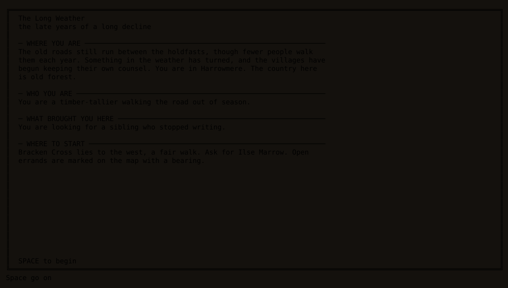
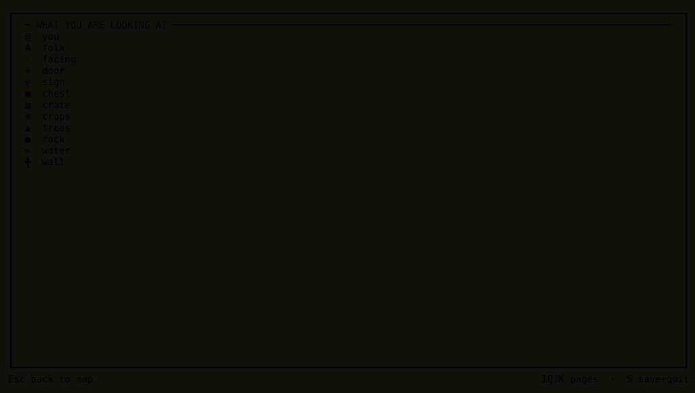

# auto-adventure

A terminal RPG on an infinite, seamless, procedurally generated world, with an
LLM as its author rather than its renderer.


```
npm install
npm start                 # pick a world, or start one
WORLD_NAME=hollowmoor npm start   # skip the menu, open that slot
NO_AI=1 npm start         # play with no model at all
SCENARIO_PROMPT="a drowned archipelago run by debt-collectors" npm start
npm run preview -- --seed vale --at 0,0    # dump a chunk to stdout
npm run preview -- --at 0,0 --ascii        # ...as one ASCII byte per tile
npm run preview -- --at 0,0 --flat         # ...with shadows and slope shading off
npm run preview -- --at 0,0 --xscale 1     # ...one column per tile instead of two
npm run author -- --id thornwick --prompt "..." --duration short   # build a scenario
npm run survey -- --seed thornwick --duration short                # dump the map, free
npm run assemble -- --draft drafts/thornwick.json                  # install a written one
npm run check             # typecheck + lint + tests
```

## The idea

The engine decides **what exists**; the model decides **what it is called and
who lives there**. No model call ever emits a tile, and no model call is ever on
the movement path.

Every tile is a pure function of `(worldSeed, globalPosition)` plus feature data
that is itself a pure function of `(worldSeed, macroCoordinate)`. There is no
boundary in the function, so there is no boundary in the output — seams are
impossible rather than repaired. A town is generated once in its own coordinate
frame and *clipped* into whichever chunks it overlaps, so a settlement straddling
four chunks is one town seen four ways.

## Layout

| Path | What it is |
|---|---|
| `src/core/` | Pure. No `fs`, `react`, `ink`, `zustand` or `ai` — enforced by lint. Worker-safe. |
| `src/core/rand` | xoshiro128\*\*, simplex noise, jittered-grid blue noise |
| `src/core/world` | Fields, biomes, macro sites, roads, rivers, weather, names |
| `src/core/gen` | The chunk pipeline and its features (settlements, buildings, interiors) |
| `src/core/rules` | `reduce(state, command, probe) → {state, effects}` — pure and total |
| `src/engine/` | Chunk manager, stitched world view, effect runner, NPC directory |
| `src/ai/` | Gateway client, director (regions and sites), dialogue and memory |
| `src/ai/author/` | The offline authoring pipeline and its prompts |
| `src/scenario/` | Artifacts, the survey, and validation against the real generator |
| `src/persist/` | Deltas-only saves, atomic writes, versioned migration |
| `src/ui/` | Ink app, panels, and the two renderers |
| `src/ui/render/` | Glyphs, autotile, ANSI run-length encoding, sprites, the kitty graphics protocol |

## Configuration

`src/config.ts` loads `dotenv-flow` before anything else, so the usual files
work out of the box. Copy `.env.example` to `.env.local` and fill in the key:

```
cp .env.example .env.local
```

Precedence, lowest to highest: `.env` → `.env.local` → `.env.[NODE_ENV]` →
`.env.[NODE_ENV].local`, and a real environment variable beats all of them:

```
AI_GATEWAY_API_KEY=sk-... npm start
```

Both `.env` and `.env.local` are git-ignored. `.env.local` is also skipped when
`NODE_ENV=test`, which is what stops the test suite from picking up a key and
quietly making live calls.

All variables are optional.

| Variable | Default | Meaning |
|---|---|---|
| `AI_GATEWAY_API_KEY` | — | Vercel AI Gateway key. Absent means the deterministic path. |
| `NO_AI` | `0` | Force the deterministic path even with a key. |
| `WORLD_SEED` | `auto-adventure` | A word or a number. |
| `WORLD_NAME` | `default` | Save slot. |
| `SCENARIO_PROMPT` | — | Freeform brief: what this world is about. |
| `SCENARIO_SETTING` | — | Refines the brief. |
| `SCENARIO_STORYLINE` | — | The story wanted from it. |
| `SCENARIO_TONE` | — | Refines the brief. |
| `SCENARIO_PROTAGONIST` | — | Who the player is. |
| `SCENARIO_AVOID` | — | Genres, tropes or subjects to keep out. |
| `SCENARIO_DURATION` | — | `short`, `medium` or `long`. Only means something when authoring. |
| `MODEL_DIRECTOR` | `google/gemini-2.5-flash-lite` | Region and site specs. |
| `MODEL_DIALOGUE` | `google/gemini-2.5-flash` | What NPCs say. |
| `MODEL_SUMMARY` | `google/gemini-2.5-flash-lite` | Rolling NPC memory. |
| `MODEL_BIBLE` | `google/gemini-2.5-flash` | The world premise, once per world. |
| `AUTO_ADVENTURE_HOME` | `~/.auto-adventure` | Where saves live. |
| `LOG_FILE`, `LOG_LEVEL` | `log.txt`, `info` | The TUI owns stdout, so logs go to a file. |
| `NO_SYNC_OUTPUT` | `0` | Stop bracketing frames in DEC mode 2026. Only needed if your terminal prints the escape instead of honouring it. |
| `NO_RELIEF` | `0` | Turn off slope shading. Costs about 14KB a frame, so worth trying if the display flickers over a slow link. |
| `TILE_WIDTH` | `2` | Terminal columns per world tile. `2` makes tiles square; `1` shows twice as much world, stretched 2:1 vertically. Glyph mode only. |
| `TILE_MODE` | `auto` | `auto` uses pixels only where the terminal is known to support them. `glyph` and `kitty` force it either way, capability check included. See [Renderers](#renderers). |
| `TILE_PX` | `16` | Pixels per tile edge in kitty mode. Sprites are procedures, not bitmaps, so any size draws. |
| `CELL_PX` | measured | `WxH` override for a terminal that will not answer `CSI 16 t` with its cell size. |
| `CONTENT_PACK` | — | A flavour pack: a shipped name (`thornwick`) or a path (`./my-pack.json`). Steers a new world only; a save keeps the pack it was made with. |

Model calls cost tokens, so they are counted: `src/ai/telemetry.ts` reports
calls, tokens and latency per call type into the log on exit.

## What it looks like

That recording is a real session, played offline with no model calls: waking up
in a village, walking up the road to the shopkeeper, going through a crate in
his house, and quitting. The stills below are particular moments.

How a game introduces itself. Every flavour opens on a full screen saying where
you are, who you are, what brought you here and — if the world has a story —
which town to make for and who to ask for when you get there — assembled from the world's own
lore, the brief it was given and the story's premise, so it works with no model
at all. The same mechanism is reused mid-journey: a story beat can raise one for
a turn a line of dialogue cannot carry.



A town from the road. The map takes the full width and every one of its rows —
where you are, the clock and the weather are pinned along the top, and the
explored world is drawn into the corner of the map itself rather than laid out
beside it. That is what lets the same layout be drawn as pixels: see
[the renderers](#renderers) below.


Talking to somebody. Conversations are choice-only — the model suggests what you
might say, and every option is a real branch rather than a text box.


Inside a building. Somebody is usually home — a weaver at her loom, a farrier
with scorched hands, a child entirely unsurprised to see you — derived from the
seed rather than written, so a town of thirty buildings costs nothing extra to
populate. Which trades live where, and how they are described, comes from a
content pack, so a scenario can be peopled by fellers and bark-peelers instead. Crates, barrels, chests and shelves can be searched, and what a
building stores depends on what it is for; a mill really does hold timber.
Outdoors the same key gathers from the ground.


The story so far, and the errand in hand. The main quest is pinned above the
errand list and needs no cursor: the steps you have reached, ticked when their
errand is finished and marked `[~]` while it is still open, and the clues the
story has told you. It counts what remains without naming it — the next step is
already the errand below, with a bearing back to the town that gave it. Quest
targets are resolved against what the engine actually built, so an NPC cannot
send you after something that was never placed.


When the last beat closes and the last errand is done, the story says so — a line in
the journal, `told` in the quest page, and a closing card the way it opened on one.
A scenario can write its own last page; one is assembled from what the player
actually did if it does not.

Everything you can go and look at takes the whole frame, inside a heavy border
that says you are in a mode: `I` for what you are carrying, `Q` for the errands,
`J` for the journal, `K` for the key. The same key puts it down again, and so
does `Esc`. It is one press either way because there is nothing smaller to be
in — a 32-column panel elided a quest description or a story clue mid-sentence,
which is exactly the part worth reading.

What you are carrying. The arrow keys move the selection and `D` drops it.
Dropping destroys the item, so it asks first, and it tells you when an open
errand still wants it.


What the glyphs mean, read out of the tile registry rather than written down, so
the key cannot start describing a colour or a character the game stopped using.



The stills are rendered from real frames by `npm run screens` — the same
compositor, palette and panels the game uses, captured through Ink and written
out as SVG. So they are a build artifact rather than a photograph of somebody's
terminal, and refreshing them after a change is one command.

The recording is [`docs/demo.tape`](docs/demo.tape), played back through
[vhs](https://github.com/charmbracelet/vhs) — `npm run build && vhs docs/demo.tape`,
which additionally needs `ttyd` and `ffmpeg`. Its keystrokes are generated rather
than written: `npx vite-node src/tools/route.ts 23` builds the same world, paths
through it with the same A\*, replays the result through a real engine to check
it, and prints the tape body.

## Controls

Arrows move; the first press of a new direction only turns, so looking at a sign
costs nothing. Walking into a door enters the building. Walking into a person
starts a conversation, as does `SPACE`. `SPACE` searches whatever you are facing:
a crate, barrel, chest or shelf indoors, or the ground itself outdoors. What a
building stores depends on what it is for — a mill really does hold timber — and
crops, forest floor, marsh, reeds and bramble each give up their own things.
Conversations are choice-only — up/down to pick, `SPACE` to answer, `ESC` to
leave.

The bar along the bottom always says which keys are live, because they change:
the arrow keys mean three different things depending on whether you are walking,
choosing a reply, or reading a list.

`I` `Q` `J` `K` open the inventory, the errands, the journal and the map key.
Each takes the whole frame inside a heavy border, and the same key puts it down
again — as does `ESC`. Inside the inventory, `D` drops what the cursor is on; it
asks first, and warns you if an open errand wants it, because there is no ground
layer to pick it back up from. `S` saves and quits, also with a confirmation.

The top bar carries the clock: a tick is a minute and a move is a tick, so an
hour of world time is sixty steps. The minimap in the corner of the map draws one
cell per chunk of the world you have walked into, `@` for where you are and `!`
for a chunk with an errand waiting; the quest list gives the same errand a
bearing in chunks — `E 2` rather than a tile count.

## Renderers

The map draws as glyphs by default and can draw as pixels instead, on terminals
that implement the kitty graphics protocol:

```bash
npm start                   # pixels only if the terminal is known to do them
TILE_MODE=kitty npm start   # pixels, no capability check
TILE_MODE=glyph npm start   # glyphs, whatever the terminal can do
npm run kitty-check         # does this terminal actually support it?
```

Left to itself the detection is conservative and every uncertainty ends in
glyphs, which are the permanent floor rather than a fallback that might one day
be dropped. `TILE_MODE` overrides it in both directions and without a check,
because a terminal that supports the protocol but does not advertise it is
something the player is better placed to know than we are. Sprites are
procedures over the unit square rather than a bitmap, so tile size is a free
choice; both renderers consume the same composed scene, so lighting, field of
view, autotiling and the minimap overlay are shared and cannot drift apart.

The layout above is what makes this possible. Ink cuts a row of Unicode
placeholders in half the moment anything shares the screen line with it, so the
map has to own every column of its rows — which is why the panel that used to sit
beside it is now a top bar, an overlay composited into the frame, and pages that
take the whole screen.

## Choosing what to play

`npm start` opens a menu: worlds to continue, scenarios to begin, and a new world
either briefed or unguided. Saves are listed most recently played first, and a
scenario world says which scenario it came from.

Two cases skip the menu, because a menu would be wrong for both: naming a slot
with `WORLD_NAME` (the caller already knows which world it wants) and having no
TTY (nothing can answer it). Both resume that slot and create it if absent, which
is what every invocation did before there was anything to choose between.

Starting a new world never lands on an existing slot — the name is derived and
then made unique. Each new world also takes its seed from its slot name, so two
new worlds are two different worlds rather than the same one twice; `WORLD_SEED`
still wins when it is set.

## Asking for a particular world

By default the model invents a premise on first contact. `SCENARIO_PROMPT` tells
it what you actually want instead:

```
SCENARIO_PROMPT="a drowned archipelago run by debt-collectors" \
  SCENARIO_AVOID="dragons" npm start
```

A brief is *intent*, never geometry. It cannot move a coastline or place a town —
the engine still decides what exists, exactly as it does with no brief at all.
The brief only reaches the calls that name and populate what the engine already
built, so an unsatisfiable brief gives you a differently-flavoured world rather
than a broken one.

A brief belongs to the world, like its seed: it is written into the save, so a
resumed world keeps generating in the same key rather than reverting to the
default premise for every region found after the reload. That also means the
environment cannot re-brief a world that already has one — start a new save slot
instead. A world that has *no* brief will adopt a configured one.

## Pre-generated scenarios

A scenario is a whole world authored ahead of time — premise, regions, towns,
people, story and conversations all written down before you play, so **no model
call happens while the game runs**:

```
npm run author -- --id drowned-archipelago \
  --prompt "a drowned archipelago run by debt-collectors" \
  --duration short
```

It lands in `~/.auto-adventure/scenarios/` and appears in the launcher. Roughly
sixty model calls for a medium world, a couple of minutes.

### Writing one by hand, or with an agent

There is a second way in, which needs no API key at all: survey the world, write a
draft, assemble it.

```
npm run survey -- --seed thornwick --duration short     # what is actually out there
$EDITOR drafts/thornwick.json                           # name it and people it
npm run assemble -- --draft drafts/thornwick.json --check
npm run assemble -- --draft drafts/thornwick.json
```

The survey prints every settlement with its position, its building capacity, the
ground it stands on and its distance from the start — all free, because the
generator is pure. A draft says only what needs judgement: beat order, gating flags,
quest ids and npc ids are derived on assembly, so a hand-written story cannot wait on
a flag nothing sets. Anything left out falls back to the deterministic content, which
makes authoring incremental — write the towns that matter, play it, come back.

The `author-scenario` skill drives exactly this loop from a Claude Code session,
asking for the pieces the game needs (duration above all, since it sets both the
number of beats and the size of the world) before it surveys anything.
`drafts/thornwick-road.json` is a worked example.

Two things make a pre-generated world better than a live one rather than merely
cheaper. First, nothing arrives late: every spec is in the state the engine starts
from, so the first frame shows the authored town, and the whole
late-spec-rebuild-commitment problem does not exist. Second, the generator is pure
and runs offline, so the tool can execute the real thing over its own output and
check what a live director structurally cannot — that the person the story hangs on
is standing at an anchor that actually got built, that the town they were assigned
to exists, that the road between two beats can be walked inside the boundary, and
that the walking roughly matches the duration asked for. It refuses to write a file
with errors in it.

A scenario is bounded: `--duration` sets both how many story beats there are and
how large the world is, since in a bounded world those are the same knob. The edge
is made of deep water, cliffs or mountains, chosen to suit the ground it is drawn
on, and it is placed so that it cuts no settlement in half.

See `docs/scenarios.md` for the design.

## Playing without a model

`NO_AI=1` is a supported way to play, not a degraded mode. Every place still gets
a name, every settlement still gets people with roles and things to tell you, and
conversations are real dialogue trees built from what those people know. What is
missing is a story tying it together — which is what the model is for.

`NO_AI=1` ignores the brief, because nothing reads it: there is no model to steer.
