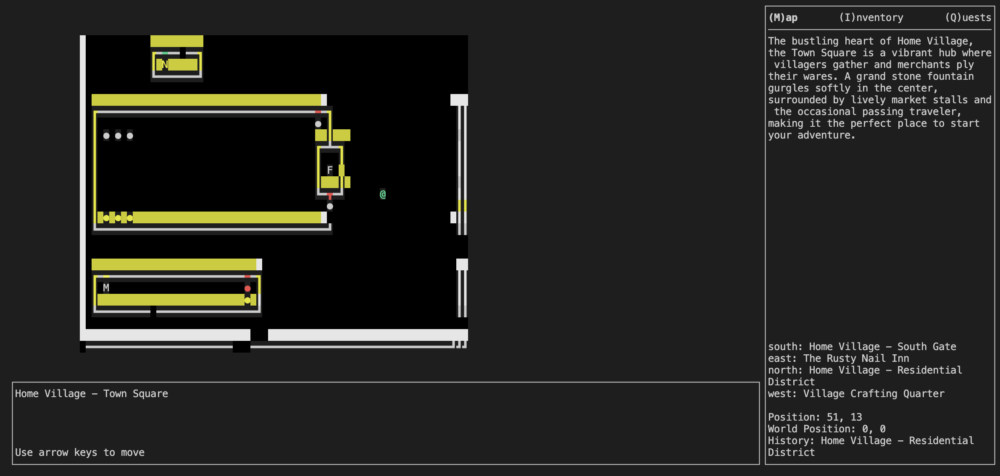

# Auto-Adventure

A terminal-based adventure game where genAI generates the maps and story as you go.

 

## Setup

1. Install dependencies:
`npm i`

2. Register your API key.
Create an `.env.local` file with your gemini API key.
```
GOOGLE_GENERATIVE_AI_API_KEY=AIz...
```
Gemini (2.5-flash) is performing at the best mix of speed, quality, and cost.
You can try other models by tweaking the code in `env.ts`

3. Build and run `npm run build` && `npm run start`.

## Dev Mode

You can run `npm run dev` and restart as needed during development.


